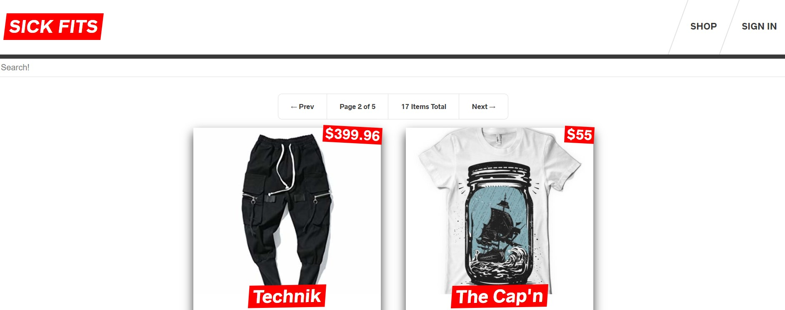

# hire this guy - e-commerce store

Tags: apollo, graphql, mysql, prismjs, react, yojajs

## Setup

- [ ]  Download the boiletplate code
    - `git clone https://github.com/wesbos/Advanced-React.git`
    - get the `frontend` and `backend` folders from the 'sick-fits' folder

## Frontend

- [ ]  Run `npm install` and then `npm run dev`
- [ ]  Setup your custom `_app.js`

    import App, { Container } from "next/app";
    
    class MyApp extends App {
      render() {
        const { Component } = this.props;
    
        return (
          <Container>
            
I'm on every page!

            <Component />
            {/* ^ I'll be the index.js and be replaced with whichever component you route to*/}
          </Container>
        );
      }
    }
    
    export default MyApp;

