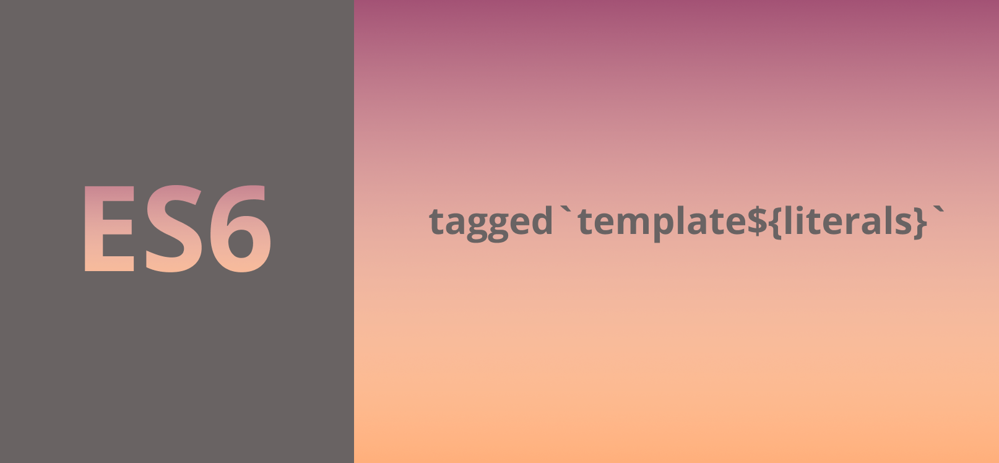

# tagged-template-literals

I came across tagged template literals while working with the styled components library when using React:

```js {6-9}
import React, { Component } from 'react';
import Header from './Header';
import Meta from './Meta';
import styled from 'styled-components';

const MyButton = styled.button`
    background: red;
    font-size: 100px;
`;


class Page extends Component {
    render() {
        return (
            <div>
                <Meta />
                <Header />
                <MyButton>
                    Click Me
                    <span>💩</span>
                </MyButton>
                {this.props.children}
            </div>
        );
    }
}

export default Page;
```

What is this crazy style of referencing a property in the syled components library then putting some text in a template literal directly after it?

_Tagged_ template literals apparently.

If you want a button on your page, the above will basically run the __button__ function in the styled components library - replace this with whichever HTML element you want - then pass in the string as an argument.  In the styled components library, the __button__ function will be written like this:

```js
function button(strings, ...values) {
  // parse the strings and build a DOM element
  // update the style sheet with the properties
}
```

```js {7}
function highlight() {
    // do something
}

const name = 'Snickers';
const age = '100';
const sentence = highlight`My dog's name is ${name} and he is ${age} years old`;
console.log(sentence)
```


